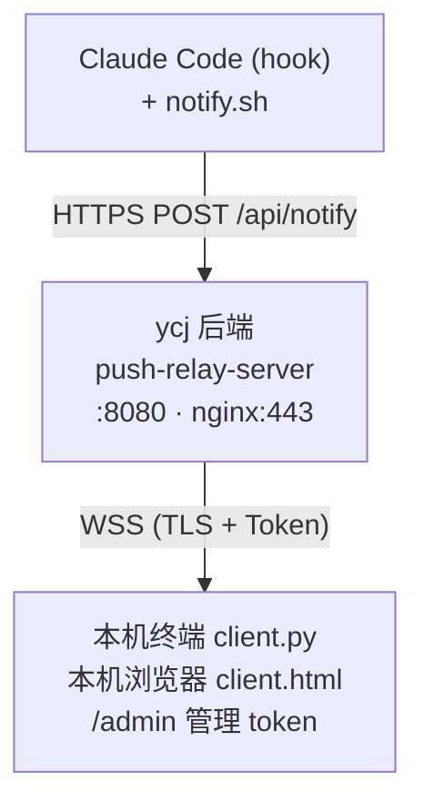

# push-relay

通过长连接 (WSS, TLS 加密 + Token 认证) 把 Claude Code 的事件实时推送到本地终端/浏览器。

## 架构



## 核心特性

- **多 token + master 鉴权** — `Argon2id` 摘要存储,明文只显示一次
- **/admin 管理页面** — 创建/吊销/轮换 token,需 master 鉴权
- **WebSocket 心跳** — 服务端 30s ping,浏览器自动重连,告别 Cloudflare 100s 断连
- **通知字段丰富** — 主机 / 工具 / 工具入参 / 任务 / 停止原因
- **时区本地化** — ISO 8601 带偏移,客户端按本地时区显示
- **向后兼容** — 老单 token 文件 + PUSH_TOKEN 环境变量自动迁移
- **WSS 关闭码语义化** — 4401/4403/4400 区分鉴权/权限/内部错误,客户端中文提示

## 目录结构

```
push-relay/
├── backend/                          # 后端 (部署到 ycj)
│   ├── server.py                     # aiohttp WebSocket relay + Token 管理 API
│   ├── requirements.txt              # Python 依赖: aiohttp, argon2-cffi
│   └── ecosystem.config.cjs          # pm2 配置
├── frontend/                         # 前端 (静态文件, nginx 直接 serve)
│   ├── client.html                   # 网页接收端 (含设置弹窗 + 按 type 过滤)
│   ├── client.py                     # 终端接收端
│   ├── admin.html                    # Token 管理页面
│   ├── notify.sh                     # Claude Code hook 脚本
│   ├── _common.css                   # 公共 CSS (两页共享)
│   └── _common.js                    # 公共 JS (escHtml + WSS 关闭码映射)
├── deploy/
│   ├── install.sh                    # ycj 一键部署
│   └── nginx.conf                    # nginx 反代 + 限流 + 静态文件
└── docs/
    ├── README.md                     # 完整文档 (部署 / 集成 / Token 系统)
    ├── OPERATIONS.md                 # 运维命令速查 (启停 / 重启 / 看日志)
    ├── FIELDS.md                     # 消息字段说明
    └── USAGE.md                      # 速查 (3 步使用)
```

注:`backend/logs/` 和 `backend/tokens.json` 是部署后才生成 (`logs/` 由 pm2 写日志时建,`tokens.json` 首次启动建)。

## 部署状态

| 组件 | 位置 | 端口 | 进程管理 |
|------|------|------|----------|
| 后端 server | `ycj:/root/push-relay/backend/` | 8080 (内部) | pm2 (push-relay-backend) |
| nginx 反代 | `ycj:/etc/nginx/conf.d/` | 443 (WSS/HTTPS) | 系统包自带 |
| 前端静态文件 | `ycj:/var/www/push-relay/` | 由 nginx serve | - |

## 快速使用

```bash
# 1. 看后端是否活着
ssh ycj 'pm2 status'

# 2. 浏览器打开接收端
open https://yangchenjie.com/

# 3. 或终端版
python3 ~/Desktop/push-relay/frontend/client.py

# 4. 管理 token
open https://yangchenjie.com/admin
```

## 文档

- [docs/README.md](docs/README.md) — 完整文档:部署、Claude Code 集成、Token 系统、WSS 协议
- [docs/OPERATIONS.md](docs/OPERATIONS.md) — 运维命令速查:启停、改代码后重启、看日志、丢 master 怎么办
- [docs/FIELDS.md](docs/FIELDS.md) — 消息字段说明
- [docs/USAGE.md](docs/USAGE.md) — 速查:3 步使用 + 常见问题
