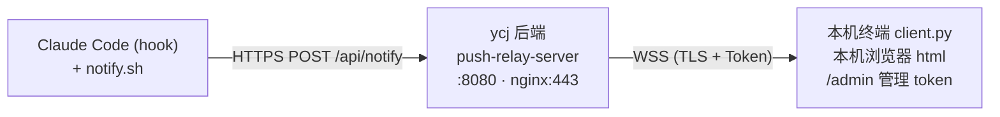

# push-relay

通过长连接（WSS，TLS 加密 + Token 认证）把 Claude Code 的事件实时推送到本地终端/浏览器。

## 架构



## 核心特性

- **多 token + master 鉴权** — `Argon2id` 摘要存储，明文只显示一次
- **/admin 管理页面** — 创建/吊销/轮换 token，需 master 鉴权
- **WebSocket 心跳** — 服务端 30s ping，浏览器自动重连，告别 Cloudflare 100s 断连
- **通知字段丰富** — 主机 / 工具 / 工具入参 / 任务 / 停止原因
- **时区本地化** — ISO 8601 带偏移，客户端按本地时区显示
- **向后兼容** — 老单 token 文件 + PUSH_TOKEN 环境变量自动迁移

## 目录结构

```
push-relay/
├── backend/                    # 后端（部署到 ycj）
│   ├── server.py               # aiohttp WebSocket relay + Token 管理 API
│   ├── requirements.txt        # Python 依赖: aiohttp, websockets, argon2-cffi
│   ├── ecosystem.config.cjs    # pm2 配置
│   ├── tokens.json             # Token 存储（Argon2id 摘要，无明文）
│   └── logs/                   # pm2 日志
├── frontend/                   # 前端
│   ├── client.html             # 网页接收端（自动重连 + 通知 + 徽章）
│   ├── client.py               # 终端接收端
│   ├── admin.html              # Token 管理页面
│   └── notify.sh               # Claude Code hook 脚本
├── deploy/                     # 部署
│   ├── install.sh              # ycj 一键部署
│   └── nginx.conf              # nginx 反代 + 限流 + 静态文件
└── docs/                       # 文档
    ├── README.md               # 详细文档
    └── USAGE.md                # 速查
```

## 部署状态

| 组件 | 位置 | 端口 | 进程管理 |
|------|------|------|---------|
| 后端 server | `ycj:/root/push-relay/backend/` | 443 (WSS/HTTPS) | pm2 (push-relay-backend) |
| 前端 serve | 本机 `frontend/` | 8080 (HTTP) | pm2 (push-relay-frontend) |
| 网页入口 | 本机浏览器 | - | - |

## 快速使用

```bash
# 1. 看后端是否活着
ssh ycj 'pm2 status'

# 2. 浏览器打开接收端
open https://yangchenjie.com/

# 3. 或终端版
python3 ~/Desktop/push-relay/frontend/client.py

# 4. 管理 token
open https://yangchenjie.com/admin
```

详细文档看 `docs/USAGE.md`（速查）和 `docs/README.md`（完整）。

## pm2 常用命令

```bash
# 后端
ssh ycj 'pm2 status && pm2 logs push-relay-backend --nostream'
ssh ycj 'pm2 restart push-relay-backend'
ssh ycj 'pm2 reload ecosystem.config.cjs'   # 改完代码后

# 前端
pm2 status
pm2 logs push-relay-frontend --nostream
pm2 restart push-relay-frontend

# 持久化（开机自启，root 跑）
ssh ycj 'pm2 save && pm2 startup'    # 跟着提示跑最后那条 sudo 命令
pm2 save && pm2 startup               # 本机
```

## 修改后重启

改了 `backend/server.py`：
```bash
rsync -avz ~/Desktop/push-relay/backend/server.py ycj:/root/push-relay/backend/
ssh ycj 'pm2 restart push-relay-backend'
```

改了 `frontend/serve.js` 或 `frontend/client.html`：
```bash
pm2 restart push-relay-frontend
```