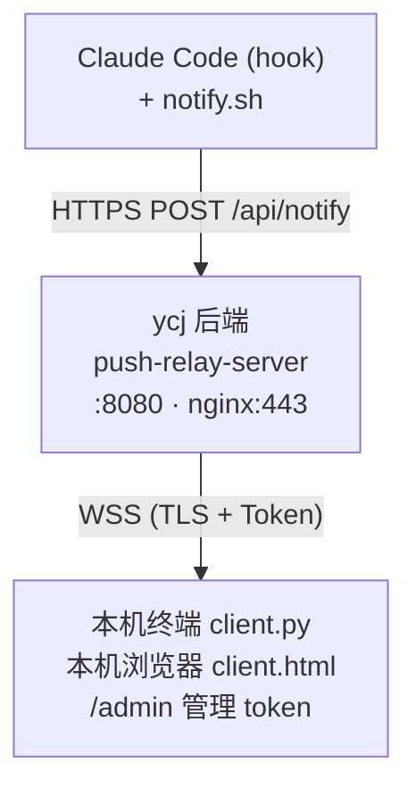

# push-relay 完整文档

通过长连接 (WSS, TLS 加密 + Token 认证) 把 Claude Code 的事件实时推送到本地终端/浏览器。

> 全新环境从零部署：见 [docs/INSTALL.md](INSTALL.md)。

## 架构



- **Server** :监听 8080,nginx 反代对外提供 443 (WSS/HTTPS)
- **Client** :任意多个,WSS 连接 server
- **触发方** :能发 HTTPS POST 的进程 (curl、Claude Code hook 等)

## 部署

### 1. 在 ycj 上安装并启动 server

```bash
ssh ycj
cd /root/push-relay
bash deploy/install.sh   # 一键装 nginx、复制前端、写 pm2 配置
```

首次启动会自动生成 master token 并写入 `backend/.master-once`,**日志里也会打印**。
把这个 master token 复制下来 (只显示这一次),然后:

```bash
ssh ycj 'rm /root/push-relay/backend/.master-once'   # 删掉一次性文件
```

日常运维命令看 [docs/OPERATIONS.md](OPERATIONS.md)。

### 2. 把 token 同步到本机

打开浏览器 → https://yangchenjie.com/admin → 输入 master token 解锁 → "+ 新建 Token" → 名称 `home-mac-terminal` → role=user → 提交。

复制显示的明文 (只显示一次!),写到本机 shell rc:

```bash
echo 'export PUSH_TOKEN="<刚复制的 user token>"' >> ~/.zshrc
source ~/.zshrc
```

### 3. 启动 client

```bash
python3 ~/Desktop/push-relay/frontend/client.py     # 终端版
# 或浏览器打开 https://yangchenjie.com/            # 网页版
```

可以多开几个,全部接收。Ctrl+C 退出。

### 4. 触发推送

```bash
curl -s -X POST "https://yangchenjie.com/api/notify?token=$PUSH_TOKEN" \
  -H "Content-Type: application/json" \
  -d '{"content":"任务完成","type":"task-done"}'
```

## 与 Claude Code 集成

`~/.claude/settings.json` 的 hook 命令 (用项目自带的 `notify.sh`,会自动从 stdin 读 Claude Code 传的 JSON、提取字段、加本机 hostname):

```json
{
  "hooks": {
    "PreToolUse":   [{ "matcher": "*", "hooks": [{ "type": "command", "command": "/Users/unkowny/Desktop/push-relay/frontend/notify.sh" }] }],
    "PostToolUse":  [{ "matcher": "*", "hooks": [{ "type": "command", "command": "/Users/unkowny/Desktop/push-relay/frontend/notify.sh" }] }],
    "Stop":         [{ "hooks":         [{ "type": "command", "command": "/Users/unkowny/Desktop/push-relay/frontend/notify.sh" }] }],
    "Notification": [{ "matcher": "*", "hooks": [{ "type": "command", "command": "/Users/unkowny/Desktop/push-relay/frontend/notify.sh" }] }]
  }
}
```

## 配置项 (环境变量)

**Server** (在 `backend/ecosystem.config.cjs` 里设,通常不用动):
- `HOST` 默认 `127.0.0.1`
- `PORT` 默认 `8080`
- `FRONTEND_DIR` 默认 `../frontend`
- `PUSH_TOKEN` 启动时作为 `user` 注入 (不落盘)

**Client** (本机 shell rc):
- `WS_URI` 默认 `wss://yangchenjie.com/api/ws`
- `PUSH_TOKEN` 必填 (从 server 同步过来)

## 消息格式

字段详细说明见 [docs/FIELDS.md](FIELDS.md)。

**Server 接收** (POST /api/notify) - 8 个字段,见 notify.sh 实际发的 payload。
**Server 推送** (WebSocket) - 9 个字段,服务端注入 `timestamp`。

## Token 系统

### 角色
- **master** - 全局唯一,管理 token (创建/吊销/轮换)、访问 /admin 页面
- **user** - 多个,可推送通知、可作为 WebSocket 接收端

### 存储
- 文件:`backend/tokens.json` (chmod 600,原子写入)
- 摘要算法:**Argon2id** (`argon2-cffi`,默认参数 m=65536, t=3, p=4)
- 明文**永不落盘** - 创建时只在响应里返回一次

### Token 格式
`pr_<role>_<24 字节 url-safe base64>`,例如:
- `pr_master_cDhyxsA2IYFHL3GcKK6tzlvxBsC0yVYG`
- `pr_user_a8f3b2c1d4e5f6g7h8j9k0l1m2n3p4q5r6s7t8`

### 管理 API (均需 master token)

| 方法 | 路径 | 说明 |
|---|---|---|
| GET | `/api/tokens` | 列出所有 token (无明文/无摘要) |
| POST | `/api/tokens` | 创建 token,响应里**唯一一次**返回明文 |
| GET | `/api/tokens/{id}` | 单条详情 |
| DELETE | `/api/tokens/{id}` | 吊销 (最后 1 个 master 不可吊销 → 409) |
| POST | `/api/tokens/{id}/rotate` | 轮换,响应里返回新明文 |

所有 admin 端点经 nginx `limit_req` 限流 (5 r/s, burst 10)。

### 兼容性
- 老 `backend/token` 单文件首次启动时自动迁移为 `user` role
- `PUSH_TOKEN` 环境变量作为 `user` 注入 (不落盘,重启仍有效)

## WebSocket 心跳

- server 端:`WebSocketResponse(heartbeat=30.0)` - 每 30s 自动发 ping
- browser 端:自动重连 (指数退避 1s → 30s 上限) + `visibilitychange` 处理
- Python 端:`ping_interval=20, ping_timeout=20`

这样保证 Cloudflare 100s 空闲超时永远不触发。

## WSS 关闭码

server 端用 44xx 段 (IANA 留给应用层) 表示语义化错误,客户端在 `frontend/_common.js` (浏览器) 和 `frontend/client.py` (终端) 都做了映射:

| code | 含义 | 客户端提示 |
|------|------|----------|
| 1000 | 正常关闭 | "正常关闭" |
| 1006 | 协议升级失败 | "连接异常(证书未信任?服务器不可达?)" |
| 1008 | 策略违规 | "连接策略违规" |
| 4401 | 鉴权失败 | "未授权(缺少或无效的 Token)" |
| 4403 | 非 master | "权限不足(非 master)" |
| 4400 | 内部错误 | "服务器内部错误" |

## 防火墙

ycj 是阿里云,安全组要放行入站 443。Rocky 本机防火墙:

```bash
firewall-cmd --permanent --add-service=https
firewall-cmd --reload
```
